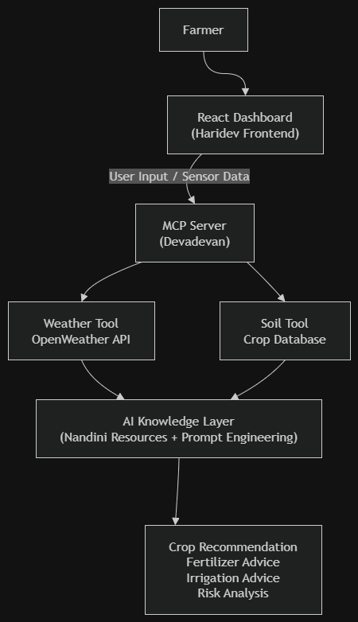
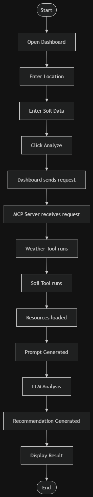

# Smart Agriculture MCP Agent

AI-powered MCP server that recommends crops and generates fertilizer/irrigation guidance from live soil and weather data.

## Open Innovation Track Justification
Our project is submitted under the Open Innovation track because agricultural resource management represents a unique intersection of biology, environmental science, and hyper-local data that does not fit neatly into the other five tracks. While it utilizes sensor data (similar to IoT), the end goal is not industrial automation, but providing actionable, biological guidance to farmers regarding crop health, soil pH balancing, and weather risk mitigation. 

## Core Features
* **Real-time Dashboard:** User interface displaying live widgets for Temperature, Humidity, Soil Moisture, pH, NPK, Weather, and Alerts.
* **Sensor Simulation:** Generates and processes live, simulated agricultural values for testing.
* **MCP Weather Tool:** Integrates with the OpenWeather API to pull hyper-local forecasts.
* **MCP Soil Tool:** Analyzes soil conditions against a custom crop database.
* **AI Knowledge Layer:** Uses specialized Prompts (Crop Advisor, Fertilizer Advisor, Risk Analysis) and Resources (Crop Database, Soil Info, Irrigation Guidelines) to generate final recommendations.

## System Architecture & Data Flow
Our system operates on a seamless flow from the UI down to the MCP primitives:

1. **Dashboard:** Farmer inputs data / views widgets.
2. **Sensor Data:** Simulated values (Moisture, NPK, pH) are gathered.
3. **MCP Server:** Acts as the central brain and routing handler.
4. **Tools & APIs:** Weather Tool (OpenWeather API) and Soil Tool process the inputs.
5. **Resources & Prompts:** The AI cross-references inputs with the Crop Database and Fertilizer guidelines.
6. **Final Recommendation:** AI generates a specific agricultural action plan.
7. **Dashboard Output:** Results and Risk Alerts are displayed to the farmer.

## Future Hardware Integration
This software architecture is designed to eventually replace the simulated data with live feeds from physical ESP32 and Arduino microcontrollers connected to real-world soil sensors in the field.
#system architecture

## 🏗️ System Architecture

  

---
## 🔄 System Workflow

  

## 📋 Documentation

- [Testing Checklist](docs/testing-checklist.md)

## 🛠️ Technology Stack

| Category | Technology |
|----------|------------|
| Frontend | React, TypeScript, Tailwind CSS |
| Backend | Node.js |
| MCP Framework | Model Context Protocol (MCP) SDK |
| AI | OpenAI / Gemini (whichever you are using) |
| Weather Data | OpenWeather API |
| Data Source | Custom Crop & Soil Knowledge Base |
| Version Control | Git & GitHub |
